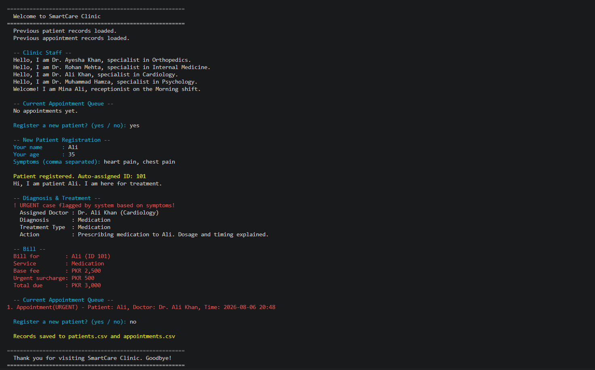

# SmartCare Clinic — Appointment & Diagnosis System

A terminal-based clinic management system built in Python with a PostgreSQL backend. Originally built as a 2nd semester final project for BS Artificial Intelligence at Ghazi University. Upgraded with a normalized relational database layer using psycopg2.

---

## What It Does

Clinic staff can register patients, assign doctors by specialization, log diagnoses, and generate bills — all from the terminal. Patient and visit data persists in a PostgreSQL database with referential integrity enforced at the schema level. Data survives between sessions — no CSV, no data loss.

---
## Screenshot



---
## Tech Stack

| Tool | Purpose |
|---|---|
| Python 3.x | Core language |
| PostgreSQL 16 | Relational database backend |
| psycopg2 | Python-to-PostgreSQL driver |
| python-dotenv | Credentials via environment variables |
| colorama | Colored terminal output |

---

## OOP Concepts Covered

- **Classes & Objects** — Patient, Doctor, Billing are all classes
- **Inheritance** — Patient, Doctor, Receptionist inherit from Person
- **Polymorphism** — `introduce()` and `apply()` behave differently per subclass
- **Encapsulation** — Private attributes `__symptoms` and `__rules` accessed via getters only
- **Abstraction** — Person and Treatment are abstract classes using ABC
- **Operator Overloading** — `__lt__`, `__gt__`, `__str__` on Appointment for sorting and display

---

## Database Schema

Three normalized tables (3NF):

```
doctors   (id, name, specialization, phone, experience_yrs, created_at)
patients  (id, name, age, phone, created_at)
visits    (id, patient_id → patients, doctor_id → doctors, diagnosis, visit_date, fee)
```

Foreign keys enforce referential integrity — no orphan visits, no missing references.

---

## Project Structure

```
SmartCare-Clinic/
├── Smart_Clinic_Appointment_&_Diagnosis_System_01.py
├── db.py              # PostgreSQL connection layer
├── queries.py         # All SQL operations (parameterized)
├── schema.sql         # Run once to create tables
├── .env               # Your credentials (not committed)
├── .env.example       # Template for other developers
├── requirements.txt
└── .gitignore
```

---

## Setup

### 1. Clone the repo

```bash
git clone https://github.com/raniarashid780-sketch/SmartCare-Clinic.git
cd SmartCare-Clinic
```

### 2. Install dependencies

```bash
pip install -r requirements.txt
```

### 3. Set up PostgreSQL

```bash
psql -U postgres -c "CREATE DATABASE smartcare;"
psql -U postgres -d smartcare -f schema.sql
```

### 4. Configure environment variables

```bash
cp .env.example .env
```

Edit `.env` with your credentials:

```
DB_HOST=localhost
DB_PORT=5432
DB_NAME=smartcare
DB_USER=postgres
DB_PASSWORD=your_password_here
```

### 5. Run

```bash
python "Smart_Clinic_Appointment_&_Diagnosis_System_01.py"
```

---

## Features

- Auto patient ID generation
- Symptom-based diagnosis engine
- Urgency detection (chest pain, fracture, etc.)
- Doctor assignment by specialization
- Billing with urgent surcharge
- Colored terminal output
- PostgreSQL persistence — data survives between sessions
- Parameterized queries — SQL injection protected

---

## Built By

Rania Rashid — BS Artificial Intelligence, Ghazi University DG Khan
GitHub: [@raniarashid780-sketch](https://github.com/raniarashid780-sketch)